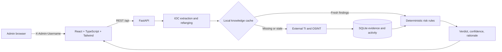

# Sentinel Threat Intelligence Workbench

Sentinel is a defensive analyst workbench for extracting candidate IOCs from alert text, enriching them through configured reputation APIs, and storing results in a local SQLite knowledge cache. The React interface talks to an authenticated FastAPI service. Provider access is optional: without configured provider keys, indicators are still persisted and remain **unknown**.

> Reputation responses are evidence from external providers, not a guarantee of safety. A missing or failed result is never represented as clean.

## Architecture



The API's SQLite database is the live knowledge cache. Cached provider findings are checked before outbound requests: VirusTotal, AbuseIPDB, and Shodan findings use the `threat_intel_api` freshness window (3 days by default); OTX uses the `osint` window (7 days by default). These values are set in `app/config.py`. Deterministic rules produce the stored verdict and rationale from usable provider findings. LLM explanation is not implemented in this build; it must not be presented as an active stage. Current username-only admin access is a local development gate, not secure authentication; keep the service bound to localhost.

## Quick start: local development

1. Copy `.env.example` to `.env`; set `SENTINEL_ADMIN_USERNAME` (defaults to `admin`). Add provider keys only for sources you use.
2. Create a Python 3.11+ virtual environment and install dependencies:

   ```powershell
   py -m venv .venv
   .\.venv\Scripts\Activate.ps1
   python -m pip install -r requirements.txt
   ```

3. Start the API from the repository root:

   ```powershell
   uvicorn app.main:app --reload --port 8000
   ```

4. In another terminal, start the web app:

   ```powershell
   cd frontend
   npm install
   npm run dev
   ```

5. Open <http://localhost:5173> and enter the configured admin username. The local default is `admin`.

The SQLite database is created at `data/sentinel.db` by default. Override it with `SENTINEL_DB_PATH`. Vite uses `http://localhost:8000` for the API by default; set `VITE_API_URL` if needed.

## Docker Compose

```shell
cp .env.example .env
# Optionally edit .env and set SENTINEL_ADMIN_USERNAME.
docker compose up --build
```

Open <http://localhost:8080>. Nginx serves the SPA and proxies `/api` to FastAPI. The `sentinel-data` named volume keeps the SQLite file across container restarts. Both ports bind to loopback for local development.

## API

All analyst data endpoints require the configured `X-Admin-Username`. `GET /api/healthz` is a minimal public liveness probe for orchestration; authenticated `GET /api/health` returns database and provider-key configuration status. Interactive docs are at `/api/docs`.

| Method and path | Purpose |
| --- | --- |
| `POST /api/extract` | Accepts `{"text":"..."}`; extracts/refangs indicators, creates an alert record, upserts indicators, returns `alert_id` and records. |
| `POST /api/enrich` | Accepts `{"alert_id":"...","indicators":[1,2]}`; creates a tracked job and returns its `job_id` promptly. |
| `GET /api/jobs/{job_id}` | Returns enrichment job state, completed/total counts, and provider warnings. Poll while a job is pending or running. |
| `GET /api/indicators` | Search/filter/paginate cached records with `page`, `page_size`, `search`, `type`, and `verdict` parameters. |
| `GET /api/indicators/{id}` | Indicator details, source alert, provider results, and related indicators. |
| `GET /api/activity` | Paginated extraction and enrichment audit events. |
| `GET /api/summary` | Counts, top types, and activity trend for the dashboard. |

Supported extracted types are IPv4, IPv6, domains, HTTP(S) URLs, MD5, SHA-1, SHA-256, CVE IDs, and email addresses. The extractor uses `iocextract` for common IOC forms and defanging/refanging, plus explicit CVE and domain support. Input length is capped by `MAX_ALERT_CHARS` (200,000 by default). API requests are limited to 120 per source IP per minute; outbound lookups have per-provider concurrency gates and conservative request spacing (one VirusTotal lookup per 15 seconds; one lookup per second for the other providers).

Enrichment uses these optional keys: `VIRUSTOTAL_API_KEY`, `ABUSEIPDB_API_KEY`, `OTX_API_KEY`, `SHODAN_API_KEY`. Provider coverage depends on IOC type. VirusTotal URL lookups use the provider's unpadded URL identifier; AbuseIPDB is queried only for IP addresses. OTX pulse matches can add suspicious evidence, while no pulse match remains unknown. Shodan port exposure is shown as context and is not itself called malicious or clean. API errors are recorded for analyst review and do not increase or lower a verdict. Risk values are provider-derived and should be interpreted alongside returned metadata.

Enrichment jobs run as FastAPI background tasks and store progress in SQLite. The local Compose setup uses one API worker. For multi-worker or multi-replica deployments, replace the in-process task runner and SQLite with a durable queue and shared database before scaling out.

## Tests

```shell
python -m pip install -r requirements-dev.txt
python -m pytest
```

The suite covers API-key enforcement, refanged IOC extraction, persistence, and the unknown-verdict behavior when no providers are configured.

## Repository map

```text
app/                 FastAPI service, extractor, enrichment adapters, SQLite layer
frontend/            React + TypeScript + Tailwind workbench
tests/               Extraction/API integration tests
data/                SQLite file (created at runtime) and demo source data
docs/                Project design notes
Dockerfile.backend   Backend image
docker-compose.yml   Local full-stack deployment
.env.example         Environment variable template; contains no secrets
```

The original `frontent/` static prototype remains as a historical mockup; run the production workbench from `frontend/`.
